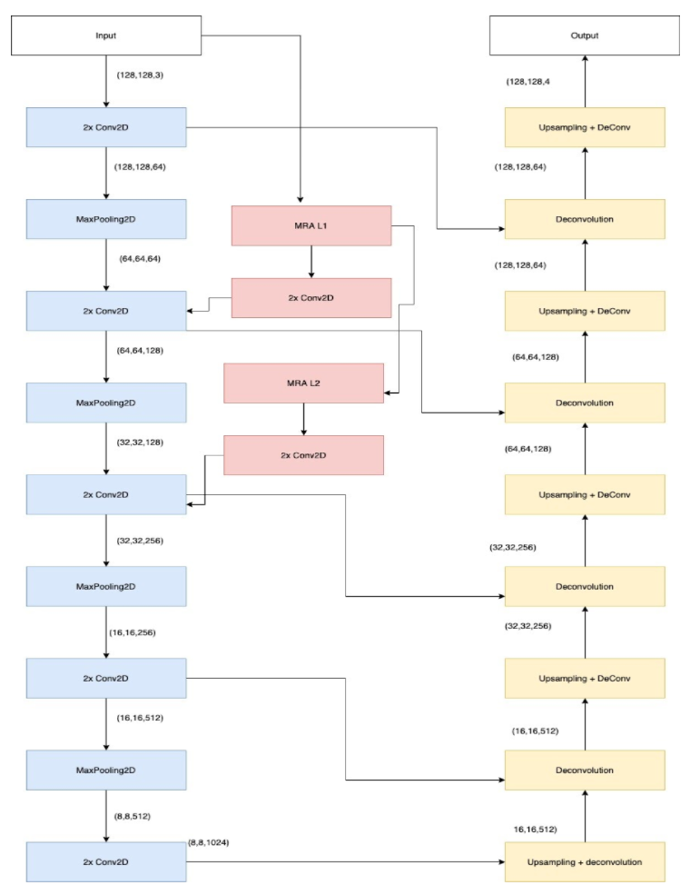
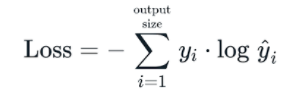
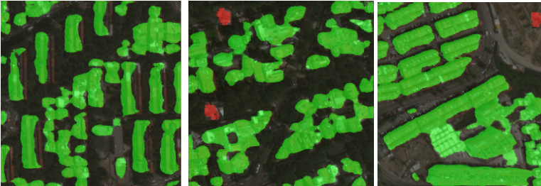

# MRANet
Semantic Segmentation of remotely sensed images for post disaster assessment


<div id="top"></div>
<!--
*** Thanks for checking out the Best-README-Template. If you have a suggestion
*** that would make this better, please fork the repo and create a pull request
*** or simply open an issue with the tag "enhancement".
*** Don't forget to give the project a star!
*** Thanks again! Now go create something AMAZING! :D
-->


<!-- PROJECT SHIELDS -->
<!--
*** I'm using markdown "reference style" links for readability.
*** Reference links are enclosed in brackets [ ] instead of parentheses ( ).
*** See the bottom of this document for the declaration of the reference variables
*** for contributors-url, forks-url, etc. This is an optional, concise syntax you may use.
*** https://www.markdownguide.org/basic-syntax/#reference-style-links
-->
[![Contributors][contributors-shield]][contributors-url]
[![Forks][forks-shield]][forks-url]
[![Stargazers][stars-shield]][stars-url]
[![Issues][issues-shield]][issues-url]
[![MIT License][license-shield]][license-url]
[![LinkedIn][linkedin-shield]][linkedin-url]


<!-- PROJECT LOGO -->
<br />
<div align="center">
  <a href="https://github.com/othneildrew/Best-README-Template">
    
  </a>

  <h3 align="center">Best-README-Template</h3>

  <p align="center">
    An awesome README template to jumpstart your projects!
    <br />
    <a href="https://github.com/othneildrew/Best-README-Template"><strong>Explore the docs »</strong></a>
    <br />
    <br />
    <a href="https://github.com/othneildrew/Best-README-Template">View Demo</a>
    ·
    <a href="https://github.com/othneildrew/Best-README-Template/issues">Report Bug</a>
    ·
    <a href="https://github.com/othneildrew/Best-README-Template/issues">Request Feature</a>
  </p>
</div>


<!-- TABLE OF CONTENTS -->
<details>
  <summary>Table of Contents</summary>
  <ol>
    <li>
      <a href="#about-the-project">About The Project</a>
      <ul>
        <li><a href="#built-with">Built With</a></li>
      </ul>
    </li>
    <li>
      <a href="#getting-started">Getting Started</a>
      <ul>
        <li><a href="#prerequisites">Prerequisites</a></li>
        <li><a href="#installation">Installation</a></li>
      </ul>
    </li>
    <li><a href="#usage">Usage</a></li>
    <li><a href="#roadmap">Roadmap</a></li>
    <li><a href="#contributing">Contributing</a></li>
    <li><a href="#license">License</a></li>
    <li><a href="#contact">Contact</a></li>
    <li><a href="#acknowledgments">Acknowledgments</a></li>
  </ol>
</details>


## Project Organization
-------
    ├── README.md       
    │   
    ├── training                <- raining codes
    │   ├── main.py
    │   ├── helper.py
    │   └── MRA_Model.py
    ├── testing                 <- Testing codes
    │   ├── main.py
    │   ├── helper.py
    │   └── MRA_Model.py
    │
    ├── utils
    │   └── metrics.py
    │   ├── Augment_Data.py     <- Main data augmentation file
    │   ├── cap_aug.py          <- File for cut paste augmentation
    │
    ├── requirements.txt        <- The requirements file for reproducing the analysis environment,
    │                              generated with `pip freeze > requirements.txt`
    ├── saved_models                  
    │   ├── checkpoint
    │   ├── model_latest.ckpt.data-00000-of-00001
    │   ├── model_latest.ckpt.index
    │   └── model_latest.ckpt.meta
    └── data
        ├── vgg
        │   ├── variables
        │   ├── make_dataset.py  <- Script to generate data
                └── ....
        


<!-- ABOUT THE PROJECT -->
## About The Project
-------

This repository is team VB210282's submission to the IITB Techfest Vision Beyond Limits(VBL) Competition.

Segmentation of remotely sensed images lies at the intersection of the domains of remote sensing and computer vision. It is used to systematically extract information from data collected by various airborne and space-borne sensors, resulting in a simpler representation. This method is used in various applications which include change detection, land cover and land use classification, resource exploration, the study of natural hazards, and mapping. In this work, we will focus on the study of natural hazards, i.e., building a multi-class semantic segmentation model that categories the given post-disaster (earthquakes in particular) imagery based on damage. 

The model is trained on the Xview2 building damage assessment dataset as provided by the IIT-B VBL team.

# Network
-------

For the given task we propose to go with the traditional U-Net architecture composed with an MRA (Multi-Resolution Analysis ) framework. The U-Net architecture is a simple encoder-decoder fully convolutional pipeline consisting of contracting (encoder) and expanding/extracting (decoder) paths. 
The MRA framework is interspersed into the U-Net Architecture in such a way that it pre-processes the inputs to the network at several stages to increase the contextual overview of the network as the same data on multiple scales is available for feature extraction and learning. 


## Why MRA? 
-------

The intuition behind using multi-resolution analysis is that images contain features at different scales important for segmentation, therefore, a multi-resolution analysis (MRA) approach is useful for their extraction since this decomposition allows us to even segment structures of various dimensions and structures with ease.


## Network Architecture
-------

<p align="center">
  
</p>

## Loss Function
-------

Categorical cross-entropy was used as the loss function

<p align="center">
  
</p>


### Setup
-------

1. Install the [virtualenv tool](https://pypi.org/project/virtualenv-tools/)
2. Create env
   ```
    python -m venv <env-name>
   ```
3. Activate env
   ```sh
   source <env-name>/bin/activate
   ```
4. ```sh
   pip install -r requirements.txt
   ```

<p align="right">(<a href="#top">back to top</a>)</p>


## Run
-------

```
python --input "<path to image>" test.py
```

## Results

<p align="center">
  
</p>

<!-- LICENSE -->
## License

Distributed under the MIT License. See `LICENSE.txt` for more information.

<p align="right">(<a href="#top">back to top</a>)</p>


<!-- CONTACT -->
## Contact

Your Name - [@your_twitter](https://twitter.com/your_username) - email@example.com

Project Link: [https://github.com/your_username/repo_name](https://github.com/your_username/repo_name)

<p align="right">(<a href="#top">back to top</a>)</p>


<!-- ACKNOWLEDGMENTS -->
## Acknowledgments

Use this space to list resources you find helpful and would like to give credit to. I've included a few of my favorites to kick things off!

* [Choose an Open Source License](https://choosealicense.com)
* [GitHub Emoji Cheat Sheet](https://www.webpagefx.com/tools/emoji-cheat-sheet)
* [Malven's Flexbox Cheatsheet](https://flexbox.malven.co/)
* [Malven's Grid Cheatsheet](https://grid.malven.co/)
* [Img Shields](https://shields.io)
* [GitHub Pages](https://pages.github.com)
* [Font Awesome](https://fontawesome.com)
* [React Icons](https://react-icons.github.io/react-icons/search)

<p align="right">(<a href="#top">back to top</a>)</p>


<!-- MARKDOWN LINKS & IMAGES -->
<!-- https://www.markdownguide.org/basic-syntax/#reference-style-links -->
[contributors-shield]: https://img.shields.io/github/contributors/othneildrew/Best-README-Template.svg?style=for-the-badge
[contributors-url]: https://github.com/othneildrew/Best-README-Template/graphs/contributors
[forks-shield]: https://img.shields.io/github/forks/othneildrew/Best-README-Template.svg?style=for-the-badge
[forks-url]: https://github.com/othneildrew/Best-README-Template/network/members
[stars-shield]: https://img.shields.io/github/stars/othneildrew/Best-README-Template.svg?style=for-the-badge
[stars-url]: https://github.com/othneildrew/Best-README-Template/stargazers
[issues-shield]: https://img.shields.io/github/issues/othneildrew/Best-README-Template.svg?style=for-the-badge
[issues-url]: https://github.com/othneildrew/Best-README-Template/issues
[license-shield]: https://img.shields.io/github/license/othneildrew/Best-README-Template.svg?style=for-the-badge
[license-url]: https://github.com/othneildrew/Best-README-Template/blob/master/LICENSE.txt
[linkedin-shield]: https://img.shields.io/badge/-LinkedIn-black.svg?style=for-the-badge&logo=linkedin&colorB=555
[linkedin-url]: https://linkedin.com/in/othneildrew
[product-screenshot]: images/screenshot.png
